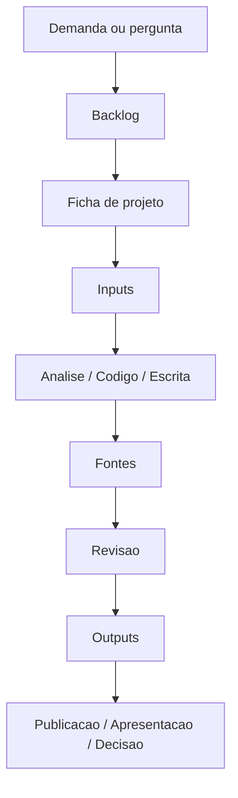

# Organizacao Visual do Workspace

Esta proposta transforma o repositorio em uma central de projetos da ENAJU sem quebrar o que ja existe.

## Visao em Camadas

```text
CAMADA 1 - Entrada
00_CENTRAL_ENAJU/

CAMADA 2 - Gestao
Backlog/
Projetos/
plano_de_acao_enaju.md
projetos_estrategicos_coordenacao.md

CAMADA 3 - Execucao
design-futuros/
futuros-da-justica/
radar-competencias-enaju/
enaju-gcpj/

CAMADA 4 - Materiais
Inputs/
Fontes/
Outputs/
```

## Tipos de Trabalho

| Tipo | Onde fica | Exemplo atual | Resultado esperado |
| --- | --- | --- | --- |
| Estrategia institucional | Raiz ou `Projetos/estrategia-*` | `plano_de_acao_enaju.md` | Diretrizes, carteira e prioridades |
| Pesquisa aplicada | Pasta propria do projeto | `enaju-gcpj`, `design-futuros` | Bases, scripts, relatorios, artigos |
| Inteligencia educacional | Pasta propria do projeto | `radar-competencias-enaju` | Dashboard, relatorios e indicadores |
| Produto digital | Pasta propria do produto | `futuros-da-justica` | Aplicacao, testes, dados e manual |
| Artigos e publicacoes | `Fontes/`, `Inputs/`, `Outputs/` ou projeto | `Artigo ENAJUS 2026` | Manuscrito, figuras e versoes finais |
| Demandas futuras | `Backlog/` | a criar | Ideias, pedidos e oportunidades |

## Padrao para Novos Projetos

Criar novos projetos dentro de `Projetos/` quando ainda forem iniciativas em estruturacao. Quando amadurecerem e tiverem codigo, base, pipeline ou produto proprio, podem ganhar pasta de primeiro nivel.

```text
Projetos/
└── nome-curto-do-projeto/
    ├── README.md
    ├── ficha-projeto.md
    ├── Inputs/
    ├── Fontes/
    ├── Outputs/
    ├── dados/
    ├── scripts/
    └── docs/
```

## Convencao de Nomes

| Elemento | Padrao sugerido | Exemplo |
| --- | --- | --- |
| Pastas de projeto | `kebab-case` | `observatorio-enaju` |
| Documentos de orientacao | `MAIUSCULO_COM_UNDERSCORE.md` | `GUIA_ACESSO.md` |
| Versoes finais | incluir data ou versao | `relatorio-v1-2026-05.docx` |
| Rascunhos | nome claro + status | `artigo-enajus-rascunho.md` |
| Bases | indicar fonte e periodo | `openalex-2020-2026.csv` |

## Estados de Projeto

| Status | Significado |
| --- | --- |
| Ideia | Ainda precisa de recorte, responsavel e produto esperado. |
| Planejado | Tem objetivo, escopo, responsavel e proximos passos. |
| Em execucao | Possui entregas em andamento. |
| Em revisao | Produto pronto para leitura tecnica, editorial ou institucional. |
| Publicado | Entregavel final disponivel em `Outputs/` ou no projeto. |
| Arquivado | Mantido para memoria, sem execucao ativa. |

## Fluxo de Materiais



## Regra de Ouro

Se uma pessoa abrir o GitHub pela primeira vez, ela deve conseguir responder em ate cinco minutos:

| Pergunta | Onde responder |
| --- | --- |
| Que projetos existem? | `04_INVENTARIO_ATUAL.md` |
| Qual e o status de cada frente? | ficha ou README do projeto |
| Onde estao os arquivos finais? | `Outputs/` |
| Onde estao os dados e referencias? | `Inputs/` |
| Como eu contribuo? | `03_ROTINA_DE_TRABALHO.md` |

