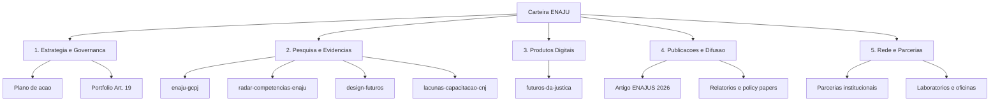

# Inventario Atual do Workspace

Leitura realizada a partir da estrutura e dos documentos principais do repositorio local `ENAJU`.

## Sintese

O workspace ja e um repositorio Git e esta conectado ao GitHub em:

```text
https://github.com/cairesmachado-svg/ENAJU
```

Ele contem uma carteira inicial de projetos da ENAJU com foco em:

| Eixo | Conteudo atual |
| --- | --- |
| Estrategia institucional | Plano de acao, portfolio de projetos estrategicos e competencias da Coordenacao de Desenvolvimento Educacional, Pesquisa e Inovacao |
| Pesquisa aplicada | Bibliometria, foresight, educacao corporativa publica e judiciaria |
| Inteligencia educacional | Radar nacional de competencias, classificacao tematica, relatorios e dashboard |
| Produtos digitais | Simulador Futuros da Justica |
| Publicacoes | Artigo ENAJUS 2026, artigo GCPJ, relatorios e manuscritos |
| Evidencias e bases | Inputs, outputs, datasets, figuras, relatorios e bases bibliograficas |

## Projetos e Frentes

| Projeto/pasta | Natureza | Status observado | Onde comecar |
| --- | --- | --- | --- |
| `Inputs/Planos/plano_de_acao_enaju.md` | Diretriz estrategica | Documento estruturado | Abrir arquivo em `Inputs/Planos/` |
| `Inputs/Planos/projetos_estrategicos_coordenacao.md` | Carteira Art. 19 | Documento estruturado com 13 projetos | Abrir arquivo em `Inputs/Planos/` |
| `Projetos/carteira-estrategica-enaju` | Governanca da carteira | Ficha inicial criada | `Projetos/carteira-estrategica-enaju/ficha-projeto.md` |
| `design-futuros` | Programa de foresight e futurismo publico | Repositorio vinculado como submodulo | `design-futuros/README.md` |
| `radar-competencias-enaju` | Inteligencia de competencias | Repositorio vinculado como submodulo | `radar-competencias-enaju/README.md` |
| `futuros-da-justica` | Produto digital | Repositorio vinculado como submodulo | `futuros-da-justica/README.md` |
| `enaju-gcpj` | Pesquisa bibliometrica | Repositorio vinculado como submodulo | `enaju-gcpj/README.md` |
| `Projetos/lacunas-capacitacao-cnj` | Pesquisa aplicada sobre evidencias formativas | Pipeline implementado; linha de base preliminar em curadoria humana | `Projetos/lacunas-capacitacao-cnj/ALERTA_PROXIMOS_PASSOS.md` |
| `balanco-socio-10` | Relatorio e revisao socioambiental | Projeto relacionado; validar permanencia no workspace ENAJU | `balanco-socio-10/README.md` |
| `Artigo ENAJUS 2026` | Publicacao | Inputs, fontes e outputs distribuidos em pastas | `Inputs/Artigo ENAJUS 2026/` e `Fontes/Artigo ENAJUS 2026/` |

## Pastas Estruturais

| Pasta | Papel recomendado | Observacao |
| --- | --- | --- |
| `00_CENTRAL_ENAJU` | Porta de entrada do workspace | Criada para orientar acesso, organizacao e rotina |
| `Backlog` | Ideias e demandas futuras | Contem backlog priorizado da carteira Art. 19 |
| `Projetos` | Novos projetos em estruturacao | Contem fichas iniciais dos projetos ativos |
| `Inputs` | Insumos, textos-base, dados e referencias | Ja contem materiais do Artigo ENAJUS e documentos de competencias |
| `Fontes` | Fontes editaveis de produtos | Ja contem artigo Quarto e figuras |
| `Outputs` | Entregaveis finais | Ja contem versoes e figuras do Artigo ENAJUS |

## Leitura dos Documentos Principais

| Documento | Conteudo identificado |
| --- | --- |
| `plano_de_acao_enaju.md` | Estruturacao da coordenacao, regras CNJ, frentes macro e proximas fases |
| `projetos_estrategicos_coordenacao.md` | 13 projetos derivados das competencias do Art. 19 |
| `design-futuros/README.md` | Programa guarda-chuva de produtos de foresight publico e futuros da justica |
| `design-futuros/produtos/README.md` | Sete produtos: observatorio, laboratorio, radar, metodologias, publicacoes, parcerias e casos |
| `radar-competencias-enaju/README.md` | MVP para mapear competencias estrategicas com pipeline e dashboard |
| `futuros-da-justica/README.md` | Simulador de cenarios futuros, competencias, trilhas e acoes |
| `enaju-gcpj/README.md` | Pipeline bibliometrico global sobre educacao corporativa publica e judiciaria |
| `enaju-gcpj/PESQUISA.md` | Passo a passo de execucao do pipeline R/Quarto |

## Recomendacao de Carteira ENAJU



> **Mapa oficial EAB ↔ Carteira Art. 19 ↔ fichas/repos:** [`Projetos/carteira-estrategica-enaju/eab-carteira-depara.md`](../Projetos/carteira-estrategica-enaju/eab-carteira-depara.md) (diagrama Mermaid + de-para).

## Proximas Melhorias Recomendadas

| Prioridade | Acao |
| --- | --- |
| Alta | Validar os responsaveis de cada ficha criada em `Projetos/`. |
| Alta | Decidir se `balanco-socio-10` permanece como submodulo ou apenas como link relacionado. |
| Media | Detalhar os projetos P1 do backlog Art. 19 em fichas completas. |
| Media | Padronizar `Inputs`, `Fontes` e `Outputs` nos projetos maiores. |
| Media | Atualizar o backlog Art. 19 apos decisao da gestao. |
