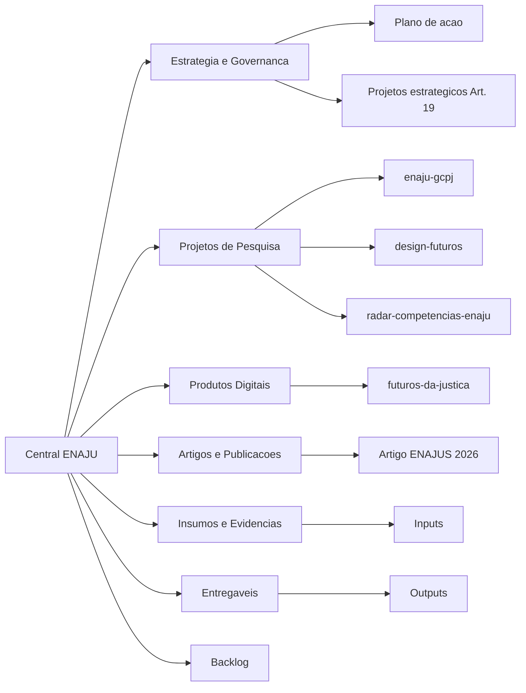

# Central de Projetos ENAJU

Este repositorio pode funcionar como o ponto unico de organizacao dos projetos da ENAJU: pesquisas, produtos digitais, artigos, diagnosticos, materiais de formacao, entregaveis e backlog.

> Proposta de uso: tratar este GitHub como uma "mesa de trabalho institucional", com uma porta de entrada simples para qualquer pessoa entender o que existe, onde encontrar cada projeto e como contribuir.

## Entrada Rapida

| Preciso de... | Comece por aqui | Uso principal |
| --- | --- | --- |
| Entender o conjunto do workspace | [04_INVENTARIO_ATUAL.md](04_INVENTARIO_ATUAL.md) | Mapa do que ja existe |
| Acessar pelo GitHub ou pelo computador | [01_COMO_ACESSAR.md](01_COMO_ACESSAR.md) | Tutorial passo a passo |
| Saber onde colocar cada tipo de trabalho | [02_ORGANIZACAO_VISUAL.md](02_ORGANIZACAO_VISUAL.md) | Arquitetura de pastas |
| Criar ou acompanhar projetos | [03_ROTINA_DE_TRABALHO.md](03_ROTINA_DE_TRABALHO.md) | Fluxo de trabalho |
| Abrir um novo projeto | [templates/FICHA_PROJETO.md](templates/FICHA_PROJETO.md) | Modelo de ficha |

## Mapa Visual do Portfolio



## Organizacao Recomendada

```text
ENAJU/
├── 00_CENTRAL_ENAJU/          # porta de entrada, tutoriais e modelos
├── Backlog/                   # ideias, demandas e proximas frentes
├── Projetos/                  # novos projetos consolidados daqui em diante
├── Inputs/                    # materiais de entrada, bases, referencias e notas
├── Outputs/                   # entregaveis finais e versoes publicaveis
├── Fontes/                    # arquivos-fonte editaveis de produtos especificos
├── design-futuros/            # programa de foresight e futurismo publico
├── futuros-da-justica/        # simulador de cenarios e competencias
├── radar-competencias-enaju/  # radar nacional de competencias
└── enaju-gcpj/                # bibliometria sobre educacao corporativa publica/judiciaria
```

## Principios

| Principio | Como aplicar |
| --- | --- |
| Uma porta de entrada | Toda pessoa nova comeca por esta pasta. |
| Projetos com ficha curta | Cada projeto deve ter objetivo, responsavel, status e proximos passos. |
| Inputs separados de Outputs | Insumos, rascunhos e bases ficam longe de produtos finais. |
| Decisoes registradas | Mudancas relevantes entram na ficha do projeto ou em notas de governanca. |
| Nomes previsiveis | Pastas e arquivos devem permitir busca facil no GitHub. |

## Status Inicial do Workspace

Este workspace ja contem projetos estruturados em quatro familias:

| Familia | Projetos/pastas atuais |
| --- | --- |
| Estrategia ENAJU | `plano_de_acao_enaju.md`, `projetos_estrategicos_coordenacao.md` |
| Pesquisa e inteligencia | `enaju-gcpj`, `radar-competencias-enaju`, `design-futuros` |
| Produtos digitais | `futuros-da-justica` |
| Publicacoes e entregaveis | `Inputs/Artigo ENAJUS 2026`, `Fontes/Artigo ENAJUS 2026`, `Outputs/Artigo ENAJUS 2026` |

## Como usar esta pasta

1. Leia o tutorial de acesso.
2. Consulte o inventario para localizar o projeto certo.
3. Use a organizacao visual para decidir onde criar novos materiais.
4. Para qualquer projeto novo, copie o modelo de ficha de projeto.
5. Registre os entregaveis finais em `Outputs/` ou na pasta propria do projeto.

