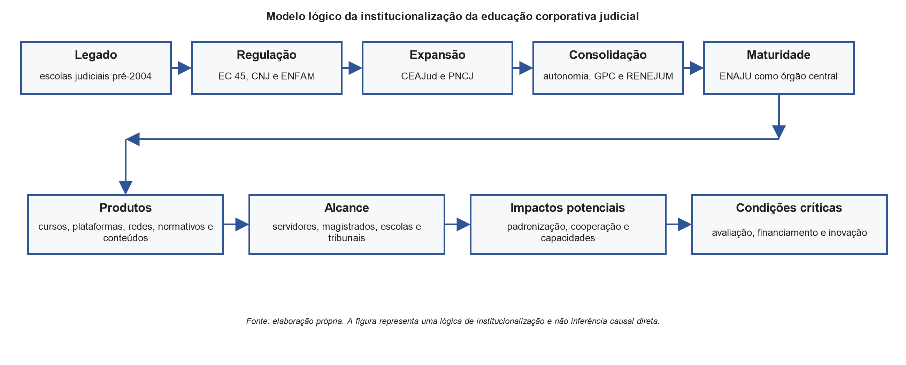

**ENAJU e Institucionalização da Educação Corporativa Judicial**

**Daniel Ribeiro Surdi Avelar**

**Paulo Marcus de Farias**

**Fabio Lopes Fernandes**

**Igor Caires Machado**


*Conselho Nacional de Justiça*

Eixo Temático: Formação e Desenvolvimento de Pessoas no Judiciário

**Resumo**

Este relatório técnico reconstrói a trajetória de institucionalização da educação corporativa no Poder Judiciário brasileiro, do voluntarismo associativo dos anos 1970 à criação da Escola Nacional do Judiciário (ENAJU) pela Resolução CNJ n. 643/2025. A análise histórico-documental identifica cinco fases: era pré-institucional (1977--2003), constitucionalização com a EC 45/2004 e a ENFAM (2004--2008), expansão para servidores com o CEAJud (2009--2011), consolidação normativa com as Resoluções CNJ n. 159/2012 e 192/2014 (2012--2024), e maturidade sistêmica com a ENAJU (2025). O modelo brasileiro distingue-se pela combinação de ancoragem constitucional, arquitetura dual-regulada (ENFAM para magistrados; ENAJU para servidores) e cooperação em rede via RENEJUM. Os resultados indicam que os principais fatores facilitadores foram a reforma constitucional estruturante de 2004, a capacidade regulatória do CNJ e o alinhamento à gestão por competências. O estudo evidencia que o desafio contemporâneo deslocou-se da escala de oferta para a mensuração de efetividade, demandando a conversão de alcance quantitativo em real capacidade institucional.

**Palavras-chave:** educação corporativa judicial; ENAJU; institucionalização; formação de servidores; gestão por competências.

**Abstract**

This technical report reconstructs the institutionalization trajectory of corporate education in the Brazilian Judiciary, from the associative voluntarism of the 1970s to the creation of the National School of the Judiciary (ENAJU) by CNJ Resolution n. 643/2025. The historical-documentary analysis identifies five phases: pre-institutional era (1977–2003), constitutionalization with EC 45/2004 and ENFAM (2004–2008), expansion to civil servants with CEAJud (2009–2011), normative consolidation with CNJ Resolutions n. 159/2012 and 192/2014 (2012–2024), and systemic maturity with ENAJU (2025). The Brazilian model stands out for its combination of constitutional anchorage, dual-regulated architecture, and network cooperation. Results indicate that the main facilitating factors were the 2004 structural constitutional reform, the CNJ's regulatory capacity, and the alignment with competency-based management. The study shows that the contemporary challenge has shifted from scale of supply to effectiveness measurement, demanding the conversion of quantitative reach into real institutional capacity.

**Keywords:** judicial corporate education; ENAJU; institutionalization; civil servant training; competency-based management.

**1. INTRODUÇÃO**

O Poder Judiciário brasileiro emprega cerca de 300 mil servidores e 18 mil magistrados distribuídos por mais de 90 tribunais em todas as unidades da federação (CNJ, 2024). Gerir o desenvolvimento profissional desse contingente --- com a heterogeneidade de competências, a capilaridade territorial e a complexidade funcional inerentes à prestação jurisdicional --- constitui um dos desafios mais sofisticados da administração pública nacional.

Historicamente compreendida como mero treinamento operacional, a formação no Judiciário revelou-se, nas últimas décadas, um problema incontornável de governança. A transição para o processo judicial eletrônico, a exigência de padronização de rotinas, a incorporação de tecnologias disruptivas e a crescente pressão social por celeridade demonstraram que capacitar pessoas não é uma atividade acessória, mas o vetor primordial de construção da capacidade institucional. O serviço público de justiça, eminentemente intensivo em conhecimento, depende diretamente das competências de seus quadros para viabilizar políticas nacionais, conduzir a transformação digital e assegurar a qualidade da prestação jurisdicional.

Este relatório técnico reconstrói a trajetória institucional da educação corporativa no Poder Judiciário brasileiro, desde as primeiras escolas da magistratura --- calcadas no voluntarismo associativo dos anos 1970 --- até a criação da Escola Nacional do Judiciário (ENAJU) em 2025. Ao adotar essa perspectiva longitudinal, o texto afasta a leitura da ENAJU como um mero evento administrativo isolado ou uma substituição nominal do antigo CEAJud. Pelo contrário, ela é o corolário de um profundo percurso de institucionalização, entendido como o processo pelo qual iniciativas fragmentadas se convertem em estruturas duráveis, dotadas de marcos normativos rígidos, instâncias de coordenação e instrumentos perenes de gestão.

A hipótese que estrutura este trabalho é que a educação corporativa judicial superou seu caráter episódico ao vincular-se progressivamente ao planejamento estratégico nacional, consolidando-se em uma arquitetura dual inédita: a ENFAM voltada à magistratura e a ENAJU focada no corpo de servidores. Essa configuração revela um amadurecimento organizacional cuja relevância reside não apenas na escala quantitativa de alcance das capacitações, mas na sistemática tentativa de converter a política de formação em um mecanismo causal e efetivo de melhoria do serviço de justiça.

**2. FUNDAMENTOS ANALÍTICOS DA EDUCAÇÃO CORPORATIVA JUDICIAL**

A educação corporativa corresponde à organização sistemática de processos de aprendizagem orientados às estratégias institucionais. Diferentemente de treinamentos pontuais desconectados, ela pressupõe perenidade, alinhamento com os objetivos fins da organização e integração contínua entre competências técnicas, comportamentais e éticas (Allen, 2002; Meister, 1998). No setor público, e especialmente no ambiente judicial, esse conceito é mobilizado para interpretar a transição de um viés puramente academicista para o desenvolvimento estruturado de capacidades estatais (OCDE, 2008).

A gestão por competências opera como a engrenagem metodológica dessa política. A noção de competência articula conhecimentos, habilidades e atitudes que devem responder diretamente às demandas concretas da prestação jurisdicional (Fleury & Fleury, 2001). No setor público brasileiro, esse enfoque fomenta a profissionalização da gestão de pessoas, abandonando a lógica do catálogo aleatório de cursos em favor de trilhas formativas desenhadas a partir dos hiatos reais de desempenho das unidades organizacionais (Dutra, 2004; Pantoja et al., 2010). A institucionalização, nesse cenário, funciona como chave analítica para evidenciar como as regras e os orçamentos estabilizam essa abordagem gerencial frente às alternâncias de gestão.

**3. METODOLOGIA**

Esta pesquisa adota delineamento histórico-documental, com análise descritivo-institucional da política de formação no Poder Judiciário. O corpus primário é composto por 14 documentos normativos federais --- emenda constitucional, resoluções do CNJ e da ENFAM e instrução normativa --- selecionados por relevância direta para a consolidação da educação corporativa judicial entre 1977 e 2025. O corpus secundário inclui literatura científica, documentos institucionais e dados administrativos sobre a formação judicial.

A análise segue três etapas: (1) periodização em fases com base nos marcos institucionais identificados; (2) análise temática de conteúdo focada na criação de órgãos, gestão por competências e redes de governança; e (3) sistematização rigorosa que diferencia produtos operacionais, alcance em escala, impactos potenciais e riscos sistêmicos.

A validade interna é garantida pela triangulação entre fontes normativas, literatura e dados do CNJ. Dentre as limitações inerentes a relatórios documentais desta natureza, ressalta-se a expressiva dependência de fontes administrativas e, primordialmente, a ausência de avaliações empíricas robustas que atestem o impacto causal dessas estruturas formativas sobre os indicadores finalísticos da eficiência judicial.

| Dimensão metodológica | Especificação no estudo | Função no relatório técnico |
|---|---|---|
| Delineamento | Pesquisa histórico-documental com análise institucional | Reconstruir a trajetória de institucionalização da educação corporativa judicial |
| Corpus primário | 14 documentos normativos federais, incluindo EC 45/2004 e resoluções do CNJ e da ENFAM | Identificar marcos formais de criação, regulação, coordenação e financiamento |
| Corpus secundário | Literatura científica, documentos institucionais e dados administrativos disponíveis | Sustentar a interpretação conceitual e a descrição da experiência |
| Estratégia analítica | Periodização, análise temática dos normativos e sistematização de resultados | Organizar a experiência institucional por fases, categorias e evidências |
| Validade interna | Triangulação entre normas, literatura e dados administrativos do CNJ | Reduzir dependência de fonte única e qualificar a inferência descritivo-analítica |
| Limitações | Ausência de dados primários de impacto e dependência de evidências administrativas | Delimitar a cautela sobre efetividade e atestar a ausência de impacto causal empírico aferido |

: Matriz metodológica do relatório técnico {#tbl-matriz-metodologica}

**4. RESULTADOS: AS CINCO FASES DA INSTITUCIONALIZAÇÃO**

```{mermaid}
%%| label: fig-linha-tempo
%%| fig-cap: "Linha do tempo da institucionalização da educação corporativa judicial"
%%| fig-width: 6.8
%%{init: {"theme": "base", "themeVariables": {"fontFamily": "Arial", "primaryColor": "#F7F8FA", "primaryBorderColor": "#2F5597", "primaryTextColor": "#1F1F1F", "lineColor": "#2F5597"}} }%%
flowchart LR
  A["1977-2003<br/><b>Pré-institucional</b><br/>escolas pioneiras"]
  B["2004-2008<br/><b>Constitucionalização</b><br/>EC 45, CNJ e ENFAM"]
  C["2009-2011<br/><b>Servidores</b><br/>PEC, CEAJud e PNCJ"]
  D["2012-2024<br/><b>Consolidação</b><br/>autonomia, GPC e RENEJUM"]
  E["2025<br/><b>ENAJU</b><br/>órgão central"]
  A --> B --> C --> D --> E
```

**4.1 Fase 1 --- Era Pré-Institucional (1977--2003): o voluntarismo como semente**

A história da educação judicial brasileira iniciou-se pela via do voluntarismo associativo. A partir da década de 1970, magistrados mobilizados pelo ideal de qualificação fundaram, no âmbito dos tribunais estaduais, as primeiras escolas da magistratura, como a Escola Judicial Desembargador Edésio Fernandes no TJMG (1977) e a AJURIS no Rio Grande do Sul. No âmbito federal, centros de estudos começaram a ser articulados descentralizadamente por Tribunais Regionais e pelo Conselho da Justiça Federal.

O ganho institucional dessa etapa foi decisivo: construiu os primeiros repertórios pedagógicos do Judiciário e legitimou culturalmente a ideia de que a formação do juiz deve ser um processo continuado após a aprovação no concurso. A limitação que permaneceu, contudo, residiu na severa desigualdade federativa da oferta e na ausência completa de diretrizes nacionais voltadas ao corpo de servidores. A fase seguinte surgiria precisamente para estancar essa fragmentação, ancorando a educação como dever constitucional imposto a todo o sistema.

**4.2 Fase 2 --- Constitucionalização (2004--2008): a ruptura de paradigma**

A promulgação da Emenda Constitucional n. 45/2004 operou transformações substanciais. Ao atrelar a "frequência e aproveitamento em cursos oficiais" à promoção de magistrados por merecimento, a emenda retirou a educação judicial da órbita exclusiva das iniciativas associativas. Além de criar o CNJ como formulador de macropolíticas e controle, o marco instituiu a Escola Nacional de Formação e Aperfeiçoamento de Magistrados (ENFAM), fixando um regulador nacional centralizado no âmbito do STJ.

O resultado organizacional dessa mudança foi a consolidação irreversível de uma política de Estado mandatória para a magistratura. A limitação inerente a esta fase, contudo, estava na assimetria de cobertura estrutural: o aparato constitucional concentrou recursos na cúpula decisória e preteriu a massa de servidores que sustenta as engrenagens burocráticas e sistêmicas das secretarias. O próprio desenvolvimento dos sistemas de tramitação digital evidenciaria rapidamente a insustentabilidade dessa ausência, demandando o próximo movimento de expansão.

**4.3 Fase 3 --- Expansão para Servidores (2009--2011): o CEAJud como resposta sistêmica**

Percebendo que a pretendida celeridade dependia maciçamente da força de trabalho dos servidores, o CNJ estabeleceu o Programa de Educação Corporativa (PEC) e logo instituiu, por intermédio da Resolução CNJ n. 111/2010, o Centro de Formação e Aperfeiçoamento de Servidores do Poder Judiciário (CEAJud). Essa resolução funcionou como indutor sistêmico ao impor aos tribunais a estruturação de unidades formativas próprias.

O avanço institucional crítico desta etapa foi o tensionamento para que os tribunais criassem uma rede e o teste prático de soluções de Educação a Distância (EaD), permitindo capacitar centenas de milhares de usuários em novos sistemas federais em tempo recorde. A limitação persistente residia na precariedade administrativa do modelo local e do próprio CEAJud, frequentemente tratado como um departamento secundário que lidava com o planejamento formativo sob a desgastada lógica do "treinamento por demanda isolada", despido de autonomia financeira.

**4.4 Fase 4 --- Consolidação Normativa (2012--2024): autonomia, competências e rede**

Buscando conferir racionalidade técnica ao sistema, o ciclo seguinte aprofundou marcos orçamentários e conceituais. A Resolução CNJ n. 159/2012 atribuiu autonomia às escolas judiciais, desvinculando-as das amarras exclusivas de recursos humanos locais. Mais robusta ainda foi a Resolução CNJ n. 192/2014, que internalizou formalmente o paradigma da gestão por competências na Política Nacional de Formação de Servidores. Adicionalmente, a institucionalização da Rede Nacional de Escolas Judiciais (RENEJUM) sedimentou o compartilhamento transversal de práticas.

O ganho inegável foi a arquitetura densa que alinhou orçamento, exigência de planos anuais orientados por competências e indicadores estratégicos nacionais. No entanto, com essa maturação local e cooperativa, evidenciou-se a grande fragilidade remanescente: a própria natureza institucional do órgão central. O CEAJud, concebido originalmente apenas como um núcleo administrativo restrito, não suportava mais o peso da governança que a rede em amadurecimento passou a exigir, exigindo a reconfiguração desenhada na fase posterior.

**4.5 Fase 5 --- Maturidade Sistêmica (2025): a ENAJU como órgão central**

Com a aprovação da Resolução CNJ n. 643/2025, o CEAJud converte-se na Escola Nacional do Judiciário (ENAJU). Este movimento não configura uma simples readequação terminológica, mas uma inequívoca elevação da unidade ao status de escola nacional com mandato normativo sólido, responsável por articular as políticas de educação do corpo funcional. 

A criação da ENAJU desloca o problema central da governança institucional: o desafio já não consiste em incentivar a abertura de escolas, mas sim gerenciar eficientemente uma rede multifacetada e integrada. A maturidade do sistema dependerá menos da consagração normativa da Escola e quase exclusivamente de sua agilidade e precisão em promover alinhamentos curriculares, redução de desperdícios por sobreposição e apoio robusto às unidades locais com deficiências orçamentárias.

**5. IMPLICAÇÕES INSTITUCIONAIS DA ARQUITETURA ATUAL**

A sedimentação desse longo percurso revela uma arquitetura de governança judicial peculiar, que se consolida com uma natureza essencialmente **dual, regulada e descentralizada**.

A dualidade evidencia-se pela convivência simétrica e articulada entre a ENFAM (dedicada à magistratura) e a ENAJU (focada nos servidores). Esta modelagem não representa sombreamento ou sobreposição burocrática, mas uma sábia leitura da multiplicidade funcional do Judiciário. A ENFAM atende à necessidade visceral de uma formação humanística, axiológica, jurisprudencial e focada na independência funcional, por isso vincula-se com acerto ao STJ. Em contraponto, o arcabouço liderado pela ENAJU exige lidar com altíssima escala operacional, metodologias ágeis de gestão cartorária, domínio de ferramentas de inteligência artificial aplicadas ao fluxo processual e padronização tecnológica, competências essenciais a serem reguladas pela centralidade estratégica do CNJ.

O pilar descentralizado reafirma que as escolas dos tribunais mantêm-se como centros gravitacionais da capilaridade e execução. É impossível que um ente isolado em Brasília alcance, com pertinência cultural e adesão tecnológica, os servidores nos recantos mais inóspitos da federação ou as peculiaridades dos sistemas processuais de cada estado. Nesse arranjo, o CNJ afasta a tentação de operar como uma estrutura centralizadora, atuando, ao revés, como instância de indução cooperativa. O marco alcançado responde, assim, à imensa complexidade de um sistema que clama por diretrizes uniformes sem violar o pacto da autonomia federativa dos tribunais, exigindo agora que o desafio da coordenação formal transforme-se concretamente em gestão sinérgica efetiva.

```{mermaid}
%%| label: fig-arquitetura-dual
%%| fig-cap: "Arquitetura institucional do sistema nacional de educação corporativa judicial"
%%| fig-width: 6.8
%%{init: {"theme": "base", "themeVariables": {"fontFamily": "Arial", "primaryColor": "#F7F8FA", "primaryBorderColor": "#2F5597", "primaryTextColor": "#1F1F1F", "lineColor": "#2F5597"}} }%%
flowchart LR
  CNJ["CNJ<br/>governança nacional"]
  STJ["STJ"]
  ENAJU["ENAJU<br/>servidores"]
  ENFAM["ENFAM<br/>magistrados"]
  RENEJUM["RENEJUM<br/>cooperação"]
  ESCOLAS["Escolas judiciais<br/>e centros de formação"]
  TRIB["Tribunais e<br/>unidades judiciárias"]
  CNJ --> ENAJU
  STJ --> ENFAM
  ENAJU --> ESCOLAS
  ENFAM --> ESCOLAS
  RENEJUM --> ESCOLAS
  ESCOLAS --> TRIB
```

**6. FATORES FACILITADORES E DIFICULTADORES**

A decodificação dessa trajetória permite o mapeamento de variáveis determinantes --- três facilitadores robustos e dificultadores que alteraram seu perfil ao longo do tempo.

**Fator facilitador 1: Reforma constitucional ancoradora.** O esteio da EC 45/2004 funcionou como trava de retrocesso (lock-in) virtuoso. Ao estipular obrigatoriedades e instituir o principal órgão balizador, isolou as agendas de qualificação do caráter errático que frequentemente acompanha os ciclos bienais de sucessão de gestores nos tribunais.
**Fator facilitador 2: Integração orgânica com o planejamento estratégico.** A partir de 2009 e com a densidade da Resolução 192/2014, ao amarrar o cumprimento de metas do CNJ e dos tribunais à execução qualificada dos Planos Anuais de Capacitação, a educação corporativa deixou de ser lida pelas cortes como uma atividade-meio ornamental e assumiu a centralidade de investimento vital para elevar índices como a taxa de congestionamento.
**Fator facilitador 3: O legado e o aprendizado das redes pregressas.** O histórico formativo de órgãos como o Copedem ofereceu um tecido institucional pronto e de extrema resiliência, permitindo que a normatividade do CNJ operasse com capilaridade a partir de uma base instalada de quadros e de vocação professoral da própria magistratura.

**Dificultadores:** Durante anos, o obstáculo insuperável traduziu-se na **assimetria orçamentária federativa**, na qual tribunais menores operavam em total vulnerabilidade de capital frente às exigências normativas. Observa-se igualmente a perpétua **tensão entre uniformidade regulatória e autonomia local**, gerando impasses de aderência. Contudo, em seu estado de maturidade atual, o dificultador inquestionável é a **fragilidade das métricas de avaliação de aprendizagem e de impacto**. As instituições dominam hoje a logística massiva de cursos, mas carecem profundamente de instrumentais para medir se as horas-aula consumidas estão de fato remediando as lacunas de proficiência ou tão somente garantindo aos egressos requisitos meramente documentais de promoção.

**7. PRODUTOS, ALCANCE, IMPACTOS POTENCIAIS E RISCOS**

Para além da leitura linear da norma, o modelo lógico da institucionalização abaixo sintetiza a conexão entre mecanismos e entregas (Figura 3).

{#fig-modelo-logico width="100%"}

Os dados atestam um poder executivo e logístico impressionante. A arquitetura de portal unificado sob tutela direta e indireta do Judiciário processou as matrículas e o fomento educacional para mais de 420 mil formandos no decorrer de suas operações históricas. A ENFAM capilariza credenciamentos para todo o efetivo de 18 mil magistrados, e a ENAJU avança de modo acelerado, aglutinando o acervo formativo nacional. 

Neste exame analítico, exige-se extremado rigor acadêmico ao delinear a fronteira entre *produtos operacionais* (tais como cursos ofertados e volume massivo de certificados) e os genuínos *impactos jurisdicionais* (que se traduziriam na verificação de elevação de proficiências sistêmicas e decréscimo das patologias procedimentais).

| Nível de evidência | Indicadores mencionados no estudo | Leitura metodológica |
|---|---|---|
| Produtos | Portal de EaD, cursos regulados, escolas credenciadas, capacitações disponíveis em plataforma unificada | Entregas institucionais diretamente observáveis e logística quantitativa |
| Alcance | Mais de 420 mil pessoas capacitadas historicamente, cerca de 18 mil magistrados abrangidos | Comprovação de extrema escalabilidade da política no Judiciário |
| Impactos potenciais | Reversão para a gestão por competências e cooperação consolidada de rede em atuação padronizada | Mudanças nas lógicas de gestão, dependentes de amadurecimento das transferências reais para o ambiente laboral |
| Limites de mensuração | Deficit crônico de evidências e dados primários que provem causalidade | Necessidade de extrema cautela, coibindo assunções precipitadas de que escala equivale automaticamente a celeridade procedimental |

: Distinção analítica entre produtos, alcance e impactos potenciais {#tbl-produtos-alcance-impactos}

Os riscos preponderantes na arquitetura formativa derivam da conversão burocrática da aprendizagem. A profusão contínua de capacitações virtuais massivas tem o condão pernicioso de encorajar a busca superficial por horas certificadas que amparam adicionais de qualificação remuneratórios, divorciando-se da aplicação profícua das técnicas na prestação do trabalho. Logo, o núcleo do desafio confiado à ENAJU não é propriamente a escalabilidade, e sim a capacidade de formular ambientes e induções nas quais a aprendizagem produza real aderência às necessidades operacionais complexas do judiciário contemporâneo.

**8. AGENDA FUTURA DE PESQUISA E GESTÃO**

Os resultados deste relatório não encerram a análise da educação corporativa judicial: pelo contrário, eles delimitam uma agenda futura em dois planos complementares. O primeiro é de pesquisa aplicada, voltado a preencher lacunas de evidências que a análise documental não pode suprir. O segundo é de gestão institucional, orientado à conversão dos ativos já construídos — escala, rede, regulação e portal — em aprendizagem verificável e mudança de práticas. Os cases de sucesso identificados ao longo deste relatório demonstram que o sistema adquiriu escala, coordenação e capilaridade, mas também revelam que os desafios contemporâneos situam-se no campo da efetividade, da avaliação e da equidade formativa entre tribunais de diferentes portes e capacidades.

**8.1 Agenda de pesquisa aplicada**

A primeira lacuna prioritária diz respeito à avaliação de impacto da formação judicial. Os dados disponíveis comprovam a expressiva capacidade de oferta — matrículas, cursos e certificados —, mas não permitem inferência causal sobre qualidade ou celeridade da prestação jurisdicional. Estudos longitudinais que acompanhem grupos de servidores antes e depois de trilhas formativas específicas seriam essenciais para estimar se a aprendizagem formal se traduz em mudança de desempenho mensurável nas unidades judiciárias.

Um segundo eixo de investigação refere-se à transferência da aprendizagem para o ambiente de trabalho. A formação produz efeitos duradouros quando encontra condições organizacionais favoráveis — suporte de chefia, oportunidade de aplicação e recursos adequados. A pesquisa sobre os fatores mediadores da transferência no contexto das secretarias e cartórios judiciais representa uma frente inexplorada, mas com alta relevância gerencial para orientar o desenho das trilhas formativas da ENAJU.

A análise de dados educacionais constitui uma terceira área de interesse. O portal unificado da ENAJU, ao concentrar registros de acesso, progresso, conclusão e avaliação de reação, gera um volume considerável de informações que pode ser explorado para mapear padrões de evasão, lacunas de engajamento, déficits de competências por área funcional e variações de uso entre tribunais. O tratamento sistemático dessas informações pode oferecer subsídios concretos para o aprimoramento contínuo da oferta formativa, desde que acompanhado de protocolos adequados de governança e proteção de dados.

A RENEJUM apresenta-se como objeto de pesquisa específico e relevante. Se o pressuposto da cooperação em rede é que ela reduz redundâncias e amplia capilaridade, o exame empírico dessa hipótese requer indicadores sobre a distribuição real da formação entre tribunais, o perfil das escolas que mais contribuem e as que mais demandam apoio, e os mecanismos pelos quais os conteúdos compartilhados são adaptados para contextos locais. Em especial, interessa avaliar se a rede contribui para reduzir as assimetrias formativas entre tribunais de maior e de menor capacidade instalada.

A validação de uma matriz nacional de competências dos servidores do Poder Judiciário constitui outra frente de pesquisa de alta prioridade. Embora a Resolução CNJ n. 192/2014 tenha institucionalizado a gestão por competências, a definição de um referencial nacional compartilhado ainda não foi concluída de modo uniforme. Pesquisas que mapeiem as competências requeridas por cargo, área e grau de complexidade das funções judiciais, e que proponham metodologias validadas de avaliação dessas competências, poderiam fundamentar tanto o planejamento formativo da ENAJU quanto a política de gestão de pessoas dos tribunais.

Por fim, a governança da arquitetura dual ENFAM–ENAJU–escolas judiciais merece atenção investigativa específica. A convivência de dois entes nacionais com mandatos distintos e uma rede de escolas locais com diferentes graus de autonomia cria riscos de sobreposição, lacuna e fragmentação. Estudos sobre os fluxos de decisão, os mecanismos de pactuação federativa e os instrumentos de coordenação entre esses elos são necessários para que a arquitetura funcione de forma sinérgica, e não concorrente.

**8.2 Agenda de gestão institucional**

No plano da gestão, a primeira prioridade é a criação de um sistema nacional de avaliação da formação judicial. O modelo atual baseia-se predominantemente em indicadores de produto — horas-aula, matrículas e certificados —, que são necessários, mas insuficientes para fundamentar decisões de investimento e melhoria. A ENAJU tem condições de liderar o desenvolvimento de instrumentos de avaliação de aprendizagem, de transferência e de resultado institucional, integrando-os ao ciclo de planejamento das escolas judiciais.

A implantação de uma matriz nacional de competências dos servidores representa o segundo vetor de gestão. Enquanto os tribunais mantiverem referenciais distintos ou ausentes de competências, as trilhas formativas permanecerão fragmentadas, sem critério objetivo de priorização. A ENAJU pode coordenar, em parceria com os tribunais e o CNJ, a construção participativa e a validação dessa matriz, tornando-a o eixo estruturante do planejamento formativo em todo o sistema.

O fortalecimento dos tribunais com menor capacidade instalada é o terceiro vetor de gestão de importância central. A assimetria entre tribunais de grande porte — com escolas bem equipadas, equipes formadas e orçamento consolidado — e os de menor porte representa uma desigualdade formativa sistêmica. A ENAJU, no exercício de seu papel indutor, pode desenvolver programas específicos de apoio técnico e curadoria de conteúdos para essas unidades, reduzindo a dependência de recursos próprios e ampliando o acesso à formação de qualidade.

A transformação da RENEJUM em ambiente ativo de coprodução de conteúdos, trilhas e metodologias constitui o quarto ponto da agenda de gestão. Atualmente, a rede funciona, em grande medida, como canal de compartilhamento. O próximo estágio de maturidade exige que as escolas participem do desenvolvimento conjunto de soluções formativas, gerando economias de escopo e fortalecendo a identidade coletiva da rede. Isso pressupõe governança clara de propriedade intelectual, fluxos de validação pedagógica e mecanismos de reconhecimento da contribuição de cada escola.

A integração entre o portal da ENAJU, o planejamento estratégico dos tribunais e a gestão de pessoas representa uma fronteira crítica ainda não completamente atravessada. A formação só adquire função estratégica plena quando os dados sobre lacunas de competências alimentam diretamente o planejamento de capacitação, que por sua vez informa decisões de seleção, movimentação e promoção de servidores. Construir essa cadeia de decisão integrada é um desafio organizacional de alta complexidade, mas essencial para converter o portal de EaD em instrumento efetivo de gestão da capacidade institucional.

A formação de formadores constitui o sexto vetor, de natureza estrutural. A qualidade pedagógica do sistema depende diretamente das competências dos professores, instrutores e tutores que atuam nas escolas judiciais. Um programa nacional de formação de formadores, conduzido pela ENAJU em cooperação com as escolas de maior experiência pedagógica, pode elevar o padrão metodológico do sistema como um todo e reduzir a dependência de contratações externas para conteúdos que o próprio corpo funcional do Judiciário tem condições de desenvolver.

Por fim, a criação de laboratórios de inovação educacional vinculados à ENAJU e às escolas de maior porte pode funcionar como espaço de teste e validação de novas abordagens — metodologias ativas, formatos híbridos e simulações de ambientes judiciais. Esses laboratórios não precisam representar grandes investimentos iniciais, mas exigem governança clara, critérios de avaliação e mecanismos para escalar as experiências bem-sucedidas para o conjunto da rede.

| Case de sucesso identificado | Aprendizado institucional | Agenda de pesquisa | Agenda de gestão |
|---|---|---|---|
| EaD do CNJ/CEAJud | Escala nacional de formação é possível | Avaliar aprendizagem e transferência para o trabalho | Criar indicadores de efetividade além de matrículas e certificados |
| ENFAM | Regulação nacional pode coexistir com escolas locais | Estudar credenciamento, qualidade pedagógica e governança de rede | Adaptar boas práticas regulatórias para a consolidação da ENAJU |
| RENEJUM | Rede reduz redundâncias e amplia capilaridade | Medir redução de desigualdades formativas entre tribunais | Transformar a rede em ambiente de coprodução |
| Portal unificado da ENAJU | Compartilhamento amplia acesso e racionaliza esforços | Analisar dados educacionais para mapear lacunas e padrões de uso | Integrar portal, trilhas e planejamento estratégico |
| Gestão por competências | Formação ganha função estratégica | Validar matriz nacional de competências | Criar trilhas por função, área e nível de complexidade |
| Arquitetura ENFAM–ENAJU–escolas judiciais | Públicos distintos exigem coordenação diferenciada | Estudar governança da arquitetura dual | Definir papéis, fluxos decisórios e mecanismos de integração |

: Quadro 2 — Agenda futura a partir dos cases de sucesso da educação corporativa judicial {#tbl-agenda-futura}

A consolidação da ENAJU como escola nacional dependerá, em última análise, da capacidade de transformar os ativos institucionais já existentes — escala de oferta, rede de cooperação, ancoragem regulatória, portal unificado e paradigma da gestão por competências — em aprendizagem aplicada, mudança verificável de práticas e fortalecimento mensurável da capacidade institucional dos tribunais. Esse é o desafio que distingue uma política de formação madura de um sistema que, apesar de sua sofisticação normativa, permanece operando na lógica da entrega de produtos sem evidência de resultado.

**9. CONCLUSÕES**

A análise aqui conduzida evidencia que a educação corporativa no Poder Judiciário brasileiro percorreu uma trajetória de institucionalização consistente e progressiva, transitando do voluntarismo associativo das primeiras escolas da magistratura para uma arquitetura nacional normativa, financiada e coordenada. A criação da ENAJU pela Resolução CNJ n. 643/2025 representa a conclusão de um ciclo de construção institucional que se estendeu por cerca de cinquenta anos, mas não encerra o processo: ela inaugura uma nova etapa, distinta das anteriores em natureza e exigência.

A arquitetura dual ENFAM–ENAJU é a expressão mais acabada do amadurecimento do sistema. A distinção de mandatos — formação da magistratura sob a coordenação do STJ e formação de servidores sob a coordenação do CNJ — não configura fragmentação, mas uma escolha deliberada de especialização funcional que reconhece a especificidade dos dois públicos. As escolas judiciais dos tribunais, por sua vez, mantêm-se como o elo de execução e capilaridade, indispensáveis para que as diretrizes nacionais alcancem a diversidade territorial e funcional do sistema de justiça.

O desafio contemporâneo, porém, não é mais o de criar estruturas: é o de demonstrar resultados. O conjunto de produtos e alcance documentado neste relatório — centenas de milhares de capacitações, portais unificados, redes de cooperação, planos estruturados por competências — representa um patrimônio institucional expressivo. Mas esse patrimônio só adquire legitimidade plena quando acompanhado de evidências sobre efetividade: se e como a formação muda práticas de trabalho, melhora a qualidade das entregas, reduz erros procedimentais e fortalece a capacidade das unidades judiciárias de cumprir sua função com tempestividade e adequação.

As desigualdades formativas entre tribunais de diferentes portes e regiões constituem um risco sistêmico que a arquitetura atual ainda não eliminou. A assimetria de capacidade instalada entre as grandes escolas metropolitanas e as unidades de comarcas menores pode reproduzir, no campo da formação, as mesmas disparidades que a política pretende corrigir na prestação jurisdicional. A governança da ENAJU precisará enfrentar esse desafio distributivo com diagnóstico claro, instrumentos concretos de equalização e mecanismos de acompanhamento continuado.

A necessidade de inovação pedagógica, de financiamento adequado e de governança articulada entre os entes da arquitetura dual não é periférica: são condições estruturais para que a política de formação seja sustentável no longo prazo. A avaliação de impacto, em particular, deixou de ser uma demanda acadêmica para se tornar uma exigência de accountability — tanto perante os servidores que investem tempo e esforço em formação quanto perante a sociedade que financia e depende do sistema de justiça.

A ENAJU não encerra o processo de institucionalização da educação corporativa judicial. Ela inaugura uma etapa em que a legitimidade da política dependerá, crescentemente, da capacidade de demonstrar resultados educacionais e institucionais verificáveis — convertendo cinco décadas de construção normativa e operacional em capacidade real de aprendizagem, mudança de práticas e melhoria mensurável do serviço público de justiça.

**REFERÊNCIAS**

**Allen, M.** (Ed.). (2002). *The corporate university handbook: Designing, managing, and growing a successful program.* AMACOM.

**Bittencourt, E.** (1966). *O juiz.* Editora do Autor.

**CNJ.** (2024). *Justiça em Números 2024.* Conselho Nacional de Justiça.

**CNJ.** (2025). *Escola Nacional do Judiciário promoverá capacitação profissional em novo portal.* https://www.cnj.jus.br/escola-nacional-do-judiciario-promovera-capacitacao-profissional-em-novo-portal/

**Dutra, J. S.** (2004). *Competências: conceitos e instrumentos para a gestão de pessoas na empresa moderna.* Atlas.

**Fleury, M. T. L., & Fleury, A.** (2001). Construindo o conceito de competência. *Revista de Administração Contemporânea, 5*(spe), 183--196.

**Meister, J. C.** (1998). *Corporate universities: Lessons in building a world-class work force* (rev. ed.). McGraw-Hill.

**OCDE.** (2008). *The challenge of capacity development: Working towards good practice.* OECD Publishing.

**Pantoja, M. J., Camões, M. R. S., & Bergue, S. T.** (Orgs.). (2010). *Gestão de pessoas: bases teóricas e experiências no setor público.* ENAP.