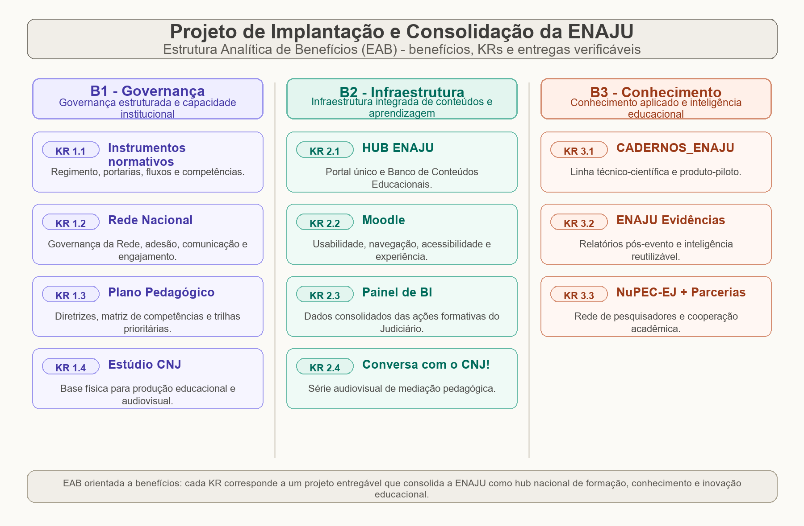

# TERMO DE ABERTURA DE PROJETO (TAP)

> Em caso de dúvida sobre o preenchimento e processo de formalização de projetos institucionais, entre em contato com o Escritório Corporativo de Projetos Institucionais — ECP — Ramal 4854.

> **Nota de versão:** Esta é a versão reestruturada do TAP da ENAJU. Ela substitui o documento "Estruturação da Escola Nacional e aperfeiçoamento de servidores do Poder Judiciário" e incorpora os ajustes recomendados na análise crítica do TAP, o fato de a ENAJU já estar instituída na estrutura orgânica do CNJ (Portaria CNJ nº 221/2026, DOU de 1º de junho de 2026) e a diretriz de reunir, como entregas (KRs), os projetos que consolidam a ENAJU como referência nacional de capacitação de servidores e hub central das escolas judiciais.

---

## IDENTIFICAÇÃO DO PROJETO

| Campo | Conteúdo |
|---|---|
| **Nome do projeto** | Projeto de Implantação e Consolidação da ENAJU: governança, infraestrutura de aprendizagem e conhecimento aplicado |
| **Data de elaboração do TAP** | ___/___/2026 *(preencher na formalização)* |
| **Patrocinador do projeto** | Dr. Paulo — Secretário da Secretaria de Estratégia e Projetos (SEP) |
| **Supervisor do Projeto / Gestor Negocial** | Dr. Daniel Avelar — Juiz Auxiliar da SEP |
| **Gerente do Projeto** | Fábio Lopes Fernandes Ramos — Diretor da ENAJU |
| **Equipe do Projeto** | Equipe técnica da ENAJU, com apoio do ECP, do DTI, da SCS e do DPJ *(indicar nominalmente os participantes na formalização)* |

---

## PLANO DE NEGÓCIO

### OBJETO DO PROJETO

Implantar operacionalmente a Escola Nacional do Judiciário (ENAJU) e consolidá-la como referência nacional de capacitação de servidores e hub central das escolas judiciais, mediante a entrega de três blocos de resultados: **(1)** instrumentos normativos de funcionamento, operacionalização da Rede Nacional, plano pedagógico nacional e estrutura física de produção; **(2)** infraestrutura integrada de conteúdos e aprendizagem (hub nacional, banco de conteúdos, modernização do Moodle, painel de BI e série audiovisual institucional); e **(3)** produção de conhecimento aplicado e inteligência educacional baseada em evidências (cadernos técnico-científicos, relatórios pós-evento e rede de pesquisadores com parcerias acadêmicas e internacionais).

Cada *Key Result* (KR) deste TAP corresponde a um **projeto entregável** que pavimenta as condições para que a ENAJU cumpra o mandato definido em seus normativos.

**Meta do projeto:** entregar todos os KRs em funcionamento, com produtos concretos e análise de resultados, **até junho de 2027**.

### JUSTIFICATIVA DO PROJETO

A transformação do antigo Centro de Aperfeiçoamento de Servidores do Poder Judiciário (Ceajud) em Escola Nacional do Judiciário (ENAJU), instituída pela **Resolução CNJ nº 643/2025**, criou nova unidade estratégica com atribuições ampliadas e papel central no Sistema Nacional de Formação e Aperfeiçoamento de Servidores do Poder Judiciário.

Diferentemente do estágio em que o primeiro TAP foi concebido, **a estrutura organizacional básica da ENAJU já está formalizada**: a **Portaria CNJ nº 221/2026** (Estrutura Orgânica do CNJ, publicada no DOU de 1º de junho de 2026) posiciona a Escola no âmbito da Secretaria de Estratégia e Projetos (SEP) e formaliza sua estrutura interna.

Com a criação e o organograma já publicados, o desafio deixou de ser **definir a estrutura** e passou a ser **implantá-la e consolidá-la operacionalmente**. Persistem, contudo, lacunas que impedem a plena execução da missão: faltam **instrumentos normativos internos e externos** que detalhem fluxos, competências e a articulação da Escola com os tribunais; a **Rede Nacional de Formação** ainda não está operacionalizada, embora prevista; não há **Plano Nacional Pedagógico de Capacitação** consolidado; e a **infraestrutura de conteúdos, aprendizagem e produção de conhecimento** ainda precisa ser construída para dar densidade à atuação nacional da Escola.

A Resolução estabelece competências de alta complexidade — formular e revisar a Política Nacional de Formação, manter plataforma unificada de gestão da educação corporativa, articular a rede de escolas judiciais, **incentivar a pesquisa aplicada e a avaliação das ações educacionais** (art. 3º, inciso VII), produzir cursos e trilhas em múltiplas modalidades e apoiar políticas judiciárias. Sem fluxos, plataformas, conteúdos, instrumentos de inteligência e capacidade de pesquisa, tais competências permanecem no plano normativo.

Este projeto responde a esse conjunto de lacunas ao organizar, como entregas verificáveis, os projetos que tornam a ENAJU efetivamente operante e que a firmam como **referência nacional em desenvolvimento, pesquisa e inovação educacional** e **hub central das escolas**, gerando valor público por meio do desenvolvimento de competências dos servidores, da modernização da educação corporativa e da promoção de uma cultura nacional de aprendizagem contínua e de decisão baseada em evidências.

### ALINHAMENTO ESTRATÉGICO

**Planejamento Estratégico**

- **Objetivo estratégico 01** — desenvolver políticas judiciárias e outros instrumentos para o aperfeiçoamento das atividades dos órgãos do Poder Judiciário e dos seus serviços auxiliares e dos serviços notariais e de registro, e dos demais órgãos correicionais.
  *Justificativa:* a consolidação operacional da ENAJU fortalece a capacidade institucional do CNJ de implementar políticas nacionais de formação que sustentam políticas judiciárias.
- **Objetivo estratégico 04** — promover a disseminação das informações, de forma padronizada e sistêmica.
  *Justificativa:* a ENAJU padronizará a oferta formativa e os instrumentos de gestão do conhecimento, com disseminação sistêmica para todo o Judiciário.
- **Objetivo estratégico 16** — aperfeiçoar políticas e práticas de Gestão de Pessoas.
  *Justificativa:* a ENAJU é responsável pela Política Nacional de Formação e Aperfeiçoamento de Servidores.

**Estratégia Nacional**

- **Macrodesafio 10:** Aperfeiçoamento da gestão de pessoas.

**Política Judiciária / Normativos**

- **Resolução CNJ nº 643/2025** — institui a ENAJU e o Sistema Nacional de Formação e Aperfeiçoamento de Servidores (fundamento de todo o projeto); o **art. 3º, inciso VII**, fundamenta o Benefício 3 (pesquisa aplicada e avaliação das ações educacionais).
- **Portaria CNJ nº 221/2026** — Estrutura Orgânica do CNJ; formaliza a ENAJU no âmbito da SEP (base da implantação operacional).
- **Resolução CNJ nº 640/2025** — Política de Comunicação do Poder Judiciário (fundamenta o KR 2.4 — série "Conversa com o CNJ!").

**Eixo de Gestão 2025-2027**

- **Eixo 2: Estrutura, Inovação e Transparência.**
  *Justificativa:* o projeto trata da implantação institucional e operacional da ENAJU — governança, organização interna, processos, normativos, infraestrutura de aprendizagem e inovação — temas diretamente alinhados ao fortalecimento estrutural e à modernização institucional do CNJ.

---

## BENEFÍCIOS / VALOR PÚBLICO DO PROJETO (BKRS)

O projeto organiza-se em **três benefícios**, cada um composto por *Key Results* que correspondem a projetos entregáveis.

### BENEFÍCIO 1 — Governança estruturada e capacidade institucional fortalecida

**Valor público:** segurança institucional, clareza de papéis e fortalecimento da capacidade operacional da ENAJU, assegurando coerência, integração e eficiência na Política Nacional de Formação e Aperfeiçoamento dos Servidores e dando à Escola as condições normativas, de rede, pedagógicas e físicas para operar em escala nacional.

**Key Results (entregas-chave):**

- **KR 1.1 — Instrumentos normativos de funcionamento interno e externo.** Regimento Interno da ENAJU, portarias e fluxos que definam competências, processos decisórios e a articulação interna de seus setores e externa (tribunais e escolas judiciais), complementando a estrutura já publicada na Portaria CNJ nº 221/2026.
- **KR 1.2 — Operacionalização da Rede Nacional de Formação e Aperfeiçoamento.** Modelo de governança e funcionamento da Rede de Escolas Judiciais (instâncias, adesão, fluxos de cooperação), incorporando a realização periódica do **Encontro Nacional de Escolas Judiciais** como espaço de articulação da Rede e, simultaneamente, de fomento à adesão e ao povoamento do HUB ENAJU (KR 2.1), com plano de comunicação, estratégia de adesão ao HUB e diretrizes de identidade institucional articuladas à SCS.
- **KR 1.3 — Plano Nacional Pedagógico de Capacitação.** Documento que traduz a Política Nacional de Formação em diretrizes pedagógicas, matriz de competências, trilhas prioritárias e critérios de qualidade para a Rede.
- **KR 1.4 — Estúdio próprio de gravação no CNJ.** Estrutura física institucional para produção de conteúdos educacionais e audiovisuais da ENAJU (base de produção dos KRs 2.4 e 3.x).

> *Como impulsiona o benefício:* os KRs 1.1–1.4 entregam, respectivamente, as **regras de operação**, a **rede operante**, a **diretriz pedagógica nacional** e a **base física de produção** — os quatro pilares da capacidade institucional da Escola.

**Indicador composto — % de implantação da governança e estrutura operacional da ENAJU**

| Componente | Critério de aceite | Peso |
|---|---|---|
| KR 1.1 | Instrumentos normativos internos/externos publicados e vigentes | 30% |
| KR 1.2 | Modelo de operacionalização da Rede aprovado; plano de comunicação e estratégia de adesão ao HUB aprovados | 25% |
| KR 1.3 | Plano Nacional Pedagógico de Capacitação aprovado | 25% |
| KR 1.4 | Estúdio implantado ou com projeto executivo/estudo técnico aprovado | 20% |

- **Meta:** 100% de implantação até junho de 2027 (encerramento do projeto).
- **Fonte de dados:** atos formais (Portarias, Resoluções), Regimento Interno, documentação da Rede, Plano Pedagógico e relatórios da ENAJU.
- **Frequência:** trimestral.

### BENEFÍCIO 2 — Infraestrutura integrada de conteúdos e aprendizagem

**Valor público:** elevação da qualidade e da amplitude da formação continuada no Judiciário, com alcance nacional, ampliando a capacidade de oferta, compartilhamento e reaproveitamento de conhecimento educacional, com metodologias adequadas e adaptadas às realidades locais.

**Key Results (entregas-chave):**

- **KR 2.1 — HUB ENAJU: portal único nacional e Banco de Conteúdos Educacionais.** Vertente em rede da ENAJU que integra, em portal único, a oferta de cursos e trilhas para servidores e estrutura o repositório nacional de conteúdos educacionais das escolas judiciais, com curadoria, metadados padronizados e reaproveitamento pelos tribunais; a adesão das escolas é impulsionada pelo Encontro Nacional (KR 1.2) e monitorada por número de escolas aderentes, percentual do universo de tribunais/escolas e quantidade de conteúdos catalogados.
- **KR 2.2 — Modernização do ambiente Moodle.** Atualização da usabilidade, da navegação, da experiência do usuário e da acessibilidade do ambiente Moodle da ENAJU.
- **KR 2.3 — Painel de Business Intelligence (BI) das ações formativas.** Painel com dados consolidados e dinâmicos das ações formativas do Poder Judiciário, com adesão progressiva dos tribunais; o protótipo funciona como marco intermediário, e o critério final é o painel operacional publicado e homologado.
- **KR 2.4 — "Conversa com o CNJ!": série audiovisual de mediação pedagógica.** Série institucional de podcasts/episódios em áudio e vídeo dedicada à divulgação, interpretação e mediação pedagógica das políticas judiciárias, com difusão de massa (YouTube/redes), ambiente de aprendizagem na plataforma da ENAJU e certificação de participação.

> *Como impulsiona o benefício:* os KRs 2.1–2.4 entregam, respectivamente, a **plataforma/hub** de integração, o **ambiente de aprendizagem** modernizado, a **inteligência de dados** das ações formativas e o **conteúdo audiovisual de alto alcance** — compondo a infraestrutura integrada de conteúdos e aprendizagem.

**Indicador composto — % de implantação da infraestrutura integrada de aprendizagem da ENAJU**

| Componente | Critério de aceite | Peso |
|---|---|---|
| KR 2.1 | HUB e Banco de Conteúdos publicados; relatório de adesão com nº de escolas aderentes, % do universo de tribunais/escolas e nº de conteúdos catalogados | 30% |
| KR 2.2 | Requisitos de modernização do Moodle homologados/implantados | 25% |
| KR 2.3 | Protótipo validado como marco intermediário e painel operacional publicado/homologado como critério final | 20% |
| KR 2.4 | 1ª temporada planejada com ato/curadoria e episódio-piloto publicado | 25% |

- **Meta:** 100% dos critérios atendidos até junho de 2027.
- **Fonte de dados:** relatórios da ENAJU, registros de adesão dos tribunais, métricas de plataforma e de difusão.
- **Frequência:** trimestral.

### BENEFÍCIO 3 (NOVO) — Conhecimento aplicado e inteligência educacional baseada em evidências

**Valor público:** transição de uma escola operadora para uma **escola pensante**, capaz de produzir evidências sobre o que funciona em educação judicial, dialogar com a academia e devolver ao Sistema conhecimento convertido em produtos formativos de qualidade superior — firmando a ENAJU como produtora de conhecimento e referência nacional.

**Key Results (entregas-chave):**

- **KR 3.1 — CADERNOS_ENAJU: linha de produção técnico-científica.** Linha editorial e metodológica da ENAJU para produzir conhecimento aplicado e trilhas formativas baseadas em evidências, com repositório versionado (GitHub) e ambiente de trabalho assistido por agentes (VS Code); produto-piloto: Caderno ENAJU nº 1.
- **KR 3.2 — ENAJU Evidências: relatórios pós-evento.** Série editorial que transforma cada ação formativa da ENAJU em inteligência institucional sistemática, rastreável e reutilizável (síntese, capacidades desenvolvidas, conexão com políticas judiciárias e agenda de continuidade), apoiada por pipeline de transcrição e análise; evento-piloto: webinário "Precisamos Falar de Cuidados e Pessoas Idosas".
- **KR 3.3 — NuPEC-EJ / Grupo de Altos Estudos: rede de pesquisadores e parcerias.** Núcleo de Pesquisa e Conhecimento em Educação Judicial, articulando pesquisadores-servidores dos tribunais em grupos temáticos, com Encontro Anual de Pesquisa (EPEJ, articulado ao EnAJUS) e **parcerias com universidades, escolas de governo e organismos internacionais** (ENAP, IOJT, EJTN, PNUD).

> *Como impulsiona o benefício:* os KRs 3.1–3.3 entregam, respectivamente, a **produção técnico-científica**, a **inteligência pós-evento** e a **rede de pesquisadores e parcerias** — os três motores que firmam a ENAJU como produtora de evidências e referência nacional.

**Indicador composto — % de implantação da agenda de conhecimento e evidências da ENAJU**

| Componente | Critério de aceite | Peso |
|---|---|---|
| KR 3.1 | Caderno ENAJU nº 1 publicado e repositório/ambiente operacional ativo | 35% |
| KR 3.2 | Série ENAJU Evidências instituída e nº de edições previstas no ciclo publicadas | 30% |
| KR 3.3 | NuPEC-EJ instituído (regulamento + 1ª chamada) e parcerias formalizadas | 35% |

- **Meta:** 100% dos critérios atendidos até junho de 2027.
- **Fonte de dados:** repositório da ENAJU, edições publicadas, atos de instituição do NuPEC-EJ e acordos/convênios vigentes.
- **Frequência:** trimestral.

---

## ESCOPO DO PROJETO E ESTRUTURA ANALÍTICA DE BENEFÍCIOS (EAB)

```
Projeto de Implantação e Consolidação da ENAJU
│
├── Benefício 1 — Governança estruturada e capacidade institucional
│   ├── KR 1.1 Instrumentos normativos internos/externos
│   ├── KR 1.2 Operacionalização da Rede Nacional
│   ├── KR 1.3 Plano Nacional Pedagógico de Capacitação
│   └── KR 1.4 Estúdio de gravação no CNJ
│
├── Benefício 2 — Infraestrutura integrada de conteúdos e aprendizagem
│   ├── KR 2.1 HUB ENAJU (portal único + Banco de Conteúdos)
│   ├── KR 2.2 Modernização do Moodle
│   ├── KR 2.3 Painel de BI
│   └── KR 2.4 "Conversa com o CNJ!" (série audiovisual)
│
└── Benefício 3 — Conhecimento aplicado e inteligência educacional baseada em evidências
    ├── KR 3.1 CADERNOS_ENAJU
    ├── KR 3.2 ENAJU Evidências (relatórios pós-evento)
    └── KR 3.3 NuPEC-EJ / Grupo de Altos Estudos + Parcerias
```

{width=100%}

### NÃO ESCOPO

Não integram o escopo deste projeto:

- a criação de cargos ou funções (a estrutura e o quadro já foram tratados pela Portaria CNJ nº 221/2026; eventual ampliação por projeto de lei é externa a este projeto);
- a aprovação de projeto de lei;
- a execução ordinária e continuada de cursos pela Escola;
- o desenvolvimento integral de um novo sistema/LMS além das melhorias previstas;
- a gestão continuada do Moodle após a implantação das melhorias;
- a alteração das estruturas das escolas judiciais dos tribunais;
- a realização de contratações externas não previstas em estudo técnico específico.

### DICIONÁRIO DA EAB

**Benefício 1 — Governança estruturada e capacidade institucional fortalecida**

- **KR 1.1 — Instrumentos normativos internos e externos.** Produção, revisão e aprovação do conjunto mínimo de normativos para o funcionamento da ENAJU (Regimento Interno, portarias, procedimentos e fluxos), definindo competências e a articulação interna de seus setores e com a Rede. Garante segurança normativa e suporte jurídico-institucional às operações da Escola.
- **KR 1.2 — Operacionalização da Rede Nacional.** Definição de instâncias, regras de adesão e fluxos de cooperação da Rede de Escolas Judiciais, incluindo o Encontro Nacional de Escolas Judiciais como espaço de articulação e integração da Rede e, ao mesmo tempo, de mobilização das escolas para a adesão e o compartilhamento de conteúdos no HUB ENAJU (KR 2.1). Inclui plano de comunicação da ENAJU, estratégia de adesão ao HUB e diretrizes de identidade institucional em articulação com a SCS.
- **KR 1.3 — Plano Nacional Pedagógico de Capacitação.** Diretrizes pedagógicas, matriz de competências, trilhas prioritárias e critérios de qualidade que materializam a Política Nacional de Formação para todo o Sistema.
- **KR 1.4 — Estúdio próprio de gravação no CNJ.** Implantação de estúdio institucional para gravação e produção de conteúdos educacionais e audiovisuais da ENAJU, base física dos KRs 2.4 e 3.x.

**Benefício 2 — Infraestrutura integrada de conteúdos e aprendizagem**

- **KR 2.1 — HUB ENAJU + Banco de Conteúdos.** Portal único nacional que integra a oferta de cursos/trilhas para servidores e o repositório nacional de conteúdos educacionais das escolas judiciais, com governança em rede, curadoria, metadados padronizados e reaproveitamento pelos tribunais. A adesão das escolas é impulsionada pelo Encontro Nacional (KR 1.2) e acompanhada por métricas objetivas de escolas aderentes, percentual de adesão sobre o universo de tribunais/escolas e conteúdos catalogados.
- **KR 2.2 — Modernização do Moodle.** Atualização de usabilidade, navegação, experiência do usuário e acessibilidade do ambiente Moodle da ENAJU.
- **KR 2.3 — Painel de BI.** Painel com dados consolidados e dinâmicos das ações formativas do Poder Judiciário, com potencial de adesão progressiva dos tribunais. O protótipo é tratado como entrega intermediária; a entrega final exige painel operacional publicado e homologado.
- **KR 2.4 — "Conversa com o CNJ!".** Série institucional em áudio e vídeo de mediação pedagógica das políticas judiciárias, com difusão de massa, ambiente de aprendizagem na plataforma da ENAJU e certificação de participação, em governança compartilhada (ENAJU, Presidência, SEP, SCS, ECP) e alinhada à Política de Comunicação do Judiciário (Res. CNJ nº 640/2025).

**Benefício 3 — Conhecimento aplicado e inteligência educacional baseada em evidências**

- **KR 3.1 — CADERNOS_ENAJU.** Linha estruturada de produção técnico-científica da ENAJU: cadernos temáticos, protocolos de pesquisa replicáveis, templates de trilhas baseadas em evidências, repositório versionado e ambiente operacional assistido por agentes; produto-piloto Caderno ENAJU nº 1.
- **KR 3.2 — ENAJU Evidências.** Série editorial que converte cada ação formativa relevante em relatório padronizado (problema público, achados, capacidades, conexão com políticas judiciárias e agenda de continuidade), apoiada por pipeline de transcrição/análise e revisão humana; evento-piloto webinário sobre cuidados e pessoas idosas.
- **KR 3.3 — NuPEC-EJ / Grupo de Altos Estudos.** Instância permanente da ENAJU que mobiliza e credencia pesquisadores-servidores, organiza grupos temáticos, mantém repositório e linha editorial, realiza o Encontro Anual de Pesquisa (EPEJ) e formaliza parcerias com universidades, escolas de governo e organismos internacionais.

---

## CRONOGRAMA DO PROJETO (POR ENTREGAS)

Cronograma orientado por **entregas verificáveis** (KRs), e não por fluxo de tramitação. As datas consideram a **aprovação do projeto e início em agosto de 2026** e o **encerramento, com tudo funcionando e analisado, em junho de 2027**. As fases de benefício correm em paralelo, conforme a capacidade das unidades envolvidas.

| ID | Fase / Entrega | Produto verificável | Responsável | Início | Término |
|---|---|---|---|---|---|
| 1 | Validação do escopo e governança do projeto | TAP elaborado, validado, aprovado e enviado ao ECP; EAB e matriz de KRs aprovadas; equipe designada | Gerente do Projeto / SEP / ECP | 01/08/2026 | 31/08/2026 |
| 2 | **Benefício 1** — Governança e estrutura | | ENAJU | 01/09/2026 | 28/02/2027 |
| 2.1 | KR 1.1 Normativos internos/externos | Regimento Interno e portarias de fluxos publicados | ENAJU / SG / DG / CONF | 01/09/2026 | 30/11/2026 |
| 2.2 | KR 1.2 Operacionalização da Rede | Modelo de governança da Rede aprovado; plano de comunicação, estratégia de adesão ao HUB e diretrizes de identidade institucional aprovados; Encontro Nacional realizado/planejado | ENAJU / SCS | 01/10/2026 | 31/01/2027 |
| 2.3 | KR 1.3 Plano Nacional Pedagógico | Plano Pedagógico aprovado | ENAJU | 01/09/2026 | 31/12/2026 |
| 2.4 | KR 1.4 Estúdio de gravação | Estúdio implantado ou projeto executivo aprovado | ENAJU / SCS / SAD | 01/09/2026 | 28/02/2027 |
| 3 | **Benefício 2** — Infraestrutura de conteúdos e aprendizagem | | ENAJU / DTI | 01/09/2026 | 30/04/2027 |
| 3.1 | KR 2.1 HUB + Banco de Conteúdos | Portal único e banco publicados; termos de adesão; relatório com escolas aderentes, % do universo e conteúdos catalogados | ENAJU / DTI | 01/10/2026 | 30/04/2027 |
| 3.2 | KR 2.2 Modernização do Moodle | Requisitos homologados/implantados | ENAJU / DTI | 01/09/2026 | 28/02/2027 |
| 3.3 | KR 2.3 Painel de BI | Protótipo validado como marco intermediário; painel operacional publicado e homologado | ENAJU / DTI | 01/11/2026 | 31/03/2027 |
| 3.4 | KR 2.4 Conversa com o CNJ! | Curadoria da 1ª temporada e episódio-piloto publicado | ENAJU / SCS / Presidência | 01/09/2026 | 31/05/2027 |
| 4 | **Benefício 3** — Conhecimento e evidências | | ENAJU | 01/09/2026 | 31/05/2027 |
| 4.1 | KR 3.1 CADERNOS_ENAJU | Caderno nº 1 publicado; repositório/ambiente ativo | ENAJU | 01/09/2026 | 31/03/2027 |
| 4.2 | KR 3.2 ENAJU Evidências | Série instituída; edições do ciclo publicadas | ENAJU | 01/09/2026 | 31/05/2027 |
| 4.3 | KR 3.3 NuPEC-EJ + Parcerias | Regulamento e 1ª chamada; parcerias formalizadas | ENAJU | 01/10/2026 | 31/05/2027 |
| 5 | Monitoramento trimestral dos indicadores dos benefícios | Relatórios trimestrais de acompanhamento dos KRs, com consolidação dos indicadores dos três benefícios | Gerente do Projeto / ENAJU / ECP | 01/09/2026 | 31/05/2027 |
| 6 | Análise final de benefícios e consolidação de evidências | Relatório de benefícios validado, análise de resultados dos produtos entregues e evidências consolidadas dos KRs | Gerente do Projeto | 01/06/2027 | 20/06/2027 |
| 7 | Encerramento formal com TEP | Termo de Encerramento do Projeto (TEP) enviado ao ECP | Gerente do Projeto | 21/06/2027 | 30/06/2027 |

---

## DESEMBOLSO FINANCEIRO

O orçamento reflete a natureza mista do projeto: entregas estritamente normativas têm custo direto nulo, enquanto entregas de infraestrutura, produção audiovisual e eventos exigem custo de capacidade institucional e/ou contratação, a detalhar por estudo técnico específico.

| Áreas | Valor (R$) | Observações / Detalhamento |
|---|---|---|
| Entregas normativas (KR 1.1, 1.2, 1.3) | 0,00 | Essencialmente normativas/administrativas, sem contratação externa. |
| Recursos de TI — HUB/portal, Moodle, BI (KR 2.1–2.3) | A detalhar por estudo técnico | Custo de capacidade do DTI; verificar reaproveitamento de soluções existentes; eventuais contratações sob estudo técnico. |
| Estúdio de gravação (KR 1.4) | A detalhar por estudo técnico | Implantação física: engenharia, equipamentos e instalação. |
| Produção audiovisual — Conversa com o CNJ! (KR 2.4) | A detalhar por estudo técnico | Gravação, edição, identidade visual e difusão; em articulação com a SCS. |
| Conhecimento e eventos (KR 3.1–3.3) | Estimativa anual | EPEJ: R$ 80–150 mil/ano; publicações/diagramação: R$ 30–60 mil/ano; plataforma/repositório: R$ 20–40 mil/ano; viagens de representação (IOJT, EJTN, eventos): R$ 30–50 mil/ano. |
| Total | A consolidar | Consolidar após estudos técnicos dos KRs com custo. Explorar fontes externas (cooperação PNUD, editais de fomento, acordos de cooperação técnica). |

---

## RISCOS

| Riscos identificados | Ações de controle |
|---|---|
| Ausência de disponibilidade de cargos/funções para a plena operacionalização da estrutura aprovada. | Acompanhar a tramitação do PL de cargos; dialogar com SGP e DG sobre alternativas transitórias; registrar condicionantes nos atos normativos. |
| Retrabalho ou atraso por ajustes normativos exigidos pelas áreas técnicas (SG, DG, DIGE/SEORG, CONF, DTI). | Alinhamentos contínuos; versões únicas e controladas; reuniões de harmonização antes da submissão final. |
| Dependência do DTI para HUB, Moodle e BI. | Alinhar escopo tecnológico desde o início; verificar reaproveitamento de soluções; solicitar análise antecipada de viabilidade. |
| Dificuldade de agenda com conselheiros para a série "Conversa com o CNJ!". | Planejamento antecipado e estrutura para gravação remota/híbrida; curadoria centralizada pela ENAJU. |
| Baixa adesão das escolas judiciais ao HUB. | Formalizar adesão por termo de cooperação; usar o Encontro Nacional como mobilizador; demonstrar valor (redução de duplicidade, especialização regional). |
| Baixa utilização dos materiais pedagógicos e conteúdos produzidos. | Integração nativa com certificação e trilhas; reaproveitamento em cursos e eventos oficiais; monitoramento por BI. |
| Sustentabilidade orçamentária plurianual das entregas de infraestrutura e conhecimento. | Incorporar ao planejamento plurianual de capacitação; buscar cooperação técnica e fontes externas de fomento. |
| Prazo de aprovação do projeto impactando o início em agosto/2026 e a meta de junho/2027. | Submeter o TAP com antecedência; priorizar entregas de caminho crítico; manter paralelismo entre os três benefícios. |
| Lacunas de governança enquanto não consolidados os fluxos internos. | Priorizar a publicação dos normativos do KR 1.1; indicar responsáveis provisórios; registrar condicionantes de implementação. |
| Sobrecarga da equipe e paralelismo excessivo de entregas estratégicas. | Priorizar por caminho crítico; realizar gestão trimestral de capacidade; escalonar ao patrocinador conflitos entre frentes que comprometam prazo, qualidade ou entrega dos benefícios. |

---

## ASSINATURA DO RESPONSÁVEL

Assinatura do Patrocinador ou Supervisor do projeto. A assinatura pode ser realizada no formulário ou no despacho de encaminhamento do SEI, ratificando as informações constantes no TAP, PGP ou TEP registrado no SEI em formato PDF.
