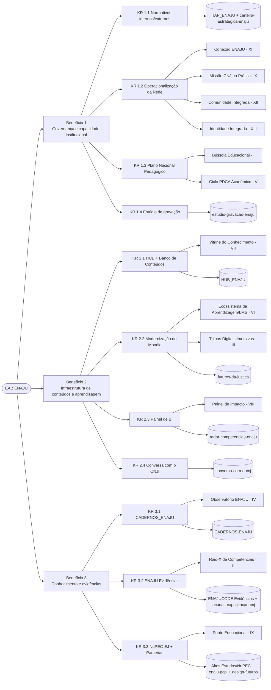

# Reconciliação EAB ↔ Carteira Art. 19 ↔ Fichas/Repos

Este documento é a **ponte de governança** do workspace ENAJU. Ele conecta as três camadas que antes viviam separadas:

1. **EAB** (do TAP reestruturado): 3 benefícios e 11 KRs.
2. **Carteira Art. 19** (`Inputs/Planos/projetos_estrategicos_coordenacao.md`): 13 projetos, um por inciso do Art. 19.
3. **Fichas e repositórios** (`Projetos/*/ficha-projeto.md` e submódulos).

A **EAB é o documento de governança no topo**. Cada projeto da Carteira e cada ficha referenciam o KR que entregam (campo `KR (EAB)`).

> Fonte canônica dos incisos: [`Inputs/Planos/projetos_estrategicos_coordenacao.md`](../../Inputs/Planos/projetos_estrategicos_coordenacao.md).
> EAB completa: [`Projetos/TAP_ENAJU/TAP_ENAJU_reestruturado.md`](../TAP_ENAJU/TAP_ENAJU_reestruturado.md).

## Diagrama

## De-para: KR (EAB) → Carteira Art. 19 → Ficha/Repo

| KR (EAB) | Projeto(s) Carteira Art. 19 (inciso) | Ficha / repo |
| --- | --- | --- |
| B1 · KR 1.1 Normativos internos/externos | — (base de governança, sem projeto Art. 19) | `Projetos/TAP_ENAJU`, `Projetos/carteira-estrategica-enaju` |
| B1 · KR 1.2 Operacionalização da Rede | Conexão ENAJU (XI); Missão CNJ na Prática (X); Comunidade Integrada (XII); Identidade Integrada (XIII) | Backlog (fichas a criar futuramente) |
| B1 · KR 1.3 Plano Nacional Pedagógico | Bússola Educacional (I); Ciclo PDCA Acadêmico (V) | Backlog |
| B1 · KR 1.4 Estúdio de gravação | — (nova ficha) | `Projetos/estudio-gravacao-enaju` |
| B2 · KR 2.1 HUB + Banco de Conteúdos | Vitrine do Conhecimento (VII); Comunidade Integrada (XII, secundário) | `Projetos/HUB_ENAJU` |
| B2 · KR 2.2 Modernização do Moodle | Ecossistema de Aprendizagem/LMS (VI); Trilhas Digitais Imersivas (III) | `futuros-da-justica` (submódulo) |
| B2 · KR 2.3 Painel de BI | Painel de Impacto (VIII) | `radar-competencias-enaju` (submódulo) |
| B2 · KR 2.4 Conversa com o CNJ! | — (nova ficha; afim a Identidade XIII) | `Projetos/conversa-com-o-cnj` |
| B3 · KR 3.1 CADERNOS_ENAJU | Observatório ENAJU (IV) | `Projetos/CADERNOS-ENAJU` |
| B3 · KR 3.2 ENAJU Evidências | Raio-X de Competências (II); Observatório ENAJU (IV, secundário) | `Projetos/ENAJUCODE Evidências`, `Projetos/lacunas-capacitacao-cnj`, `radar-competencias-enaju` |
| B3 · KR 3.3 NuPEC-EJ + Parcerias | Ponte Educacional (IX) | `Projetos/Altos Estudos` (NuPEC), `enaju-gcpj`, `design-futuros` |

## De-para inverso: Carteira Art. 19 (inciso) → KR

| # | Projeto Art. 19 | Inciso | Frente | KR (EAB) |
| --- | --- | --- | --- | --- |
| 1 | Bússola Educacional | I | Política e Planejamento | KR 1.3 |
| 2 | Raio-X de Competências | II | Diagnósticos e Mapeamento | KR 3.2 *(célula a validar — ver nota)* |
| 3 | Trilhas Digitais Imersivas | III | Inovação e Tecnologia Educacional | KR 2.2 |
| 4 | Observatório ENAJU | IV | Avaliação e Dados | KR 3.1 (e 3.2 secundário) |
| 5 | Ciclo PDCA Acadêmico | V | Inovação e Tecnologia Educacional | KR 1.3 |
| 6 | Ecossistema de Aprendizagem (LMS) | VI | Inovação e Tecnologia Educacional | KR 2.2 |
| 7 | Vitrine do Conhecimento | VII | Governança da Rede | KR 2.1 *(célula a validar)* |
| 8 | Painel de Impacto (Dashboard) | VIII | Avaliação e Dados | KR 2.3 |
| 9 | Ponte Educacional | IX | Governança da Rede | KR 3.3 *(célula a validar)* |
| 10 | Missão CNJ na Prática | X | Governança da Rede | KR 1.2 |
| 11 | Conexão ENAJU | XI | Governança da Rede | KR 1.2 |
| 12 | Comunidade Integrada | XII | Governança da Rede | KR 1.2 (e 2.1 secundário) |
| 13 | Identidade Integrada | XIII | Governança da Rede | KR 1.2 |

## Notas e células a validar pela gestão

- **Raio-X de Competências (II):** posicionado em **KR 3.2** (evidências/inteligência educacional); alternativa é **KR 1.3** (insumo de planejamento / LNC). Decisão da gestão.
- **Vitrine do Conhecimento (VII):** posicionada em **KR 2.1** (catálogo/hub); poderia migrar para o Benefício 3 (disseminação de conhecimento).
- **Ponte Educacional (IX):** posicionada em **KR 3.3** (parcerias/TCT); também tangencia **KR 1.2** (governança da Rede).
- **KRs sem projeto Art. 19 correspondente:** KR 1.1 (normativos), KR 1.4 (estúdio) e KR 2.4 (série Conversa) — entregas próprias do TAP, com fichas dedicadas.
- **Repositórios de pesquisa/publicação** (`enaju-gcpj`, `design-futuros`, `lacunas-capacitacao-cnj`, `artigo-enajus-2026`) alimentam sobretudo o **Benefício 3**.
